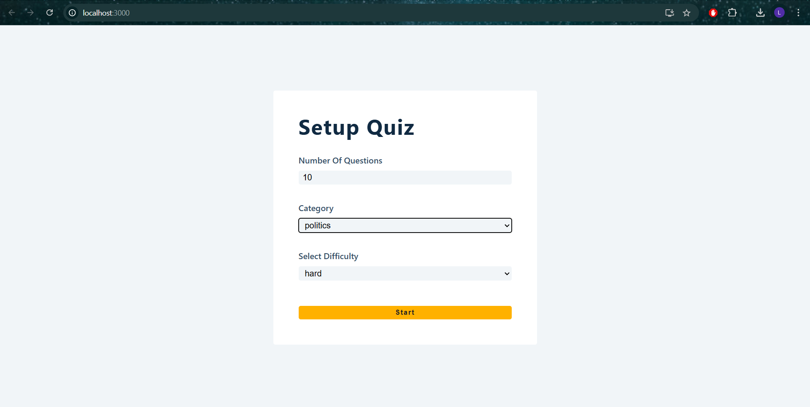
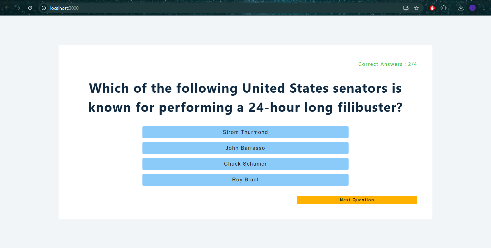
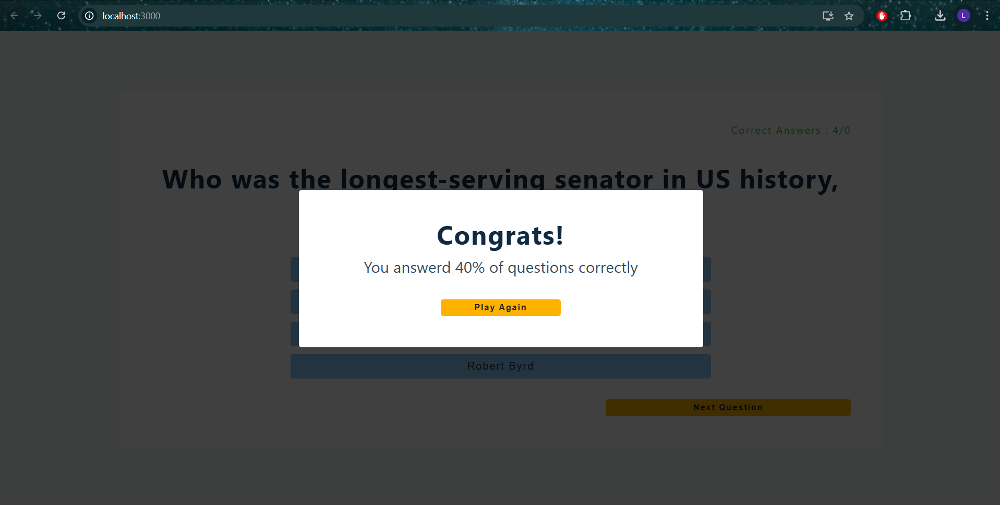

# Quiz App

A full-stack Quiz App built with **React** for the frontend, **Node.js + Express** for the backend, and **MongoDB** for data storage.

## 📦 Features

- Create and take quizzes
- User authentication (if enabled)
- Dynamic question and score handling
- RESTful API integration
- Responsive UI with React

---

## 🚀 Getting Started

### Prerequisites

- Node.js & npm
- MongoDB (local or Atlas)
- Git

---

#### ScreenShots
|                    Start Page                    |                  Question Screen                  |                Finish Game Screen                 |               
|:-------------------------------------------------:|:-------------------------------------------------:|:-------------------------------------------------:|
|  |  |  | 

### 🔧 Installation

1. **Clone the repository**

git clone (https://github.com/LwaziG/QuizApp.git)
cd Quiz-App
Set up the backend

cd backend
npm install
Create a .env file in the backend folder:

env

MONGO_URL=mongodb://localhost:27017/quiz-app
PORT=5000
Run the backend server

npm start
Set up the frontend

cd ../frontend
npm install
npm start
🌐 Access the App
Frontend: http://localhost:3000

Backend API: http://localhost:5000

## 🧠 Technologies Used
React

Node.js

Express.js

MongoDB / Mongoose

CSS

## ✍️ Author

##### Lwazi Gumede

## 📄 License
This project is open source and available under the MIT License.
